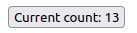

# Web pages

After you've created your project, the simplest way to start a web-based project is to run `derw template --template web --path src/Main.derw`.

That will generate the following file at `src/Main.derw:`

```elm
import "../derw-packages/derw-lang/html/src/Html" exposing ( HtmlNode, RunningProgram, div, text, program, attribute, class_ )

type alias Model = {
}

initialModel: Model
initialModel =
    { }

type Msg =
    Noop

update: Msg -> Model -> (Msg -> void) -> Model
update msg model send =
    case msg of
        Noop ->
            model

view: Model -> HtmlNode Msg
view model =
    div [ ] [ ] [ text "Hello" ]

root: any
root =
    document.getElementById "root"

main: RunningProgram Model Msg
main =
    program {
        initialModel: initialModel,
        view: view,
        update: update,
        root: root
    }
```

### Imports

First we import the types and some functions from the html package.

```elm
import "../derw-packages/derw-lang/html/src/Html" exposing ( HtmlNode, RunningProgram, div, text, program, attribute, class_ )
```

### Model

The model is the representation of the information required. The generator provides you with an empty one, along with an object literal which you will use for the first render. See [types](../fundamentals/types.md) for more information.

```elm
type alias Model = {
}

initialModel: Model
initialModel =
    { }
```

### Update

Here we define two things: firstly, the union type that represents all possible actions, which in this case we called `Msg`. Secondly, the update function which takes in an action message, the current model, and a callback for sending messages from async operations. It returns a new version of the model to be used.

```elm
type Msg =
    Noop

update: Msg -> Model -> (Msg -> void) -> Model
update msg model send =
    case msg of
        Noop ->
            model
```

### View

We also define a view function, which takes a model and returns html created by the html package functions.

```elm
view: Model -> HtmlNode Msg
view model =
    div [ ] [ ] [ text "Hello" ]
```

### Root and running

Finally, to hook up the renderer, we grab an element from your index.html file, and use it to contain our Derw program.

```elm
root: any
root =
    document.getElementById "root"

main: RunningProgram Model Msg
main =
    program {
        initialModel: initialModel,
        view: view,
        update: update,
        root: root
    }
```

## Next steps

Imagine you'd like to change the program so that there is a button that when you click on it, it will increment in value and display the value.

### Model

First we would want to edit the model so that it contains a value that we can increment.

```elm
type alias Model = {
    currentNumber: number
}

initialModel: Model
initialModel =
    { currentNumber: 0 }
```

### Update

Next we'll add a message to our `Msg` type - to represent when a user has clicked on the button. We'll also add the logic for incrementing the current number to the update function.

```elm
type Msg =
    Noop
    | Increment

update: Msg -> Model -> (Msg -> void) -> Model
update msg model send =
    case msg of
        Noop ->
            model
            
        Increment ->
            { ...model, currentNumber: model.currentNumber + 1 }
```

### View

We'll also add an onClick listener to the view, and show the current number. Note to do so, we also need to update our import:

```elm
import "../derw-packages/derw-lang/html/src/Html" as Html exposing ( HtmlNode, RunningProgram, div, text, program, attribute, class_ )
```

Now we will be able to refer to the html library via `Html`

```elm
view: Model -> HtmlNode Msg
view model =
    Html.button 
        [ Html.onClick (\_ -> Increment) ] 
        [ ] 
        [ text `Current count: ${model.currentNumber}` ]
```

### Finally

That's it! You now have an incrementing button. You code should look something like this:

```elm
import "../derw-packages/derw-lang/html/src/Html" as Html exposing ( HtmlNode, RunningProgram, div, text, program, attribute, class_ )

type alias Model = {
    currentNumber: number
}

initialModel: Model
initialModel =
    { currentNumber: 0 }

type Msg =
    Noop
    | Increment

update: Msg -> Model -> (Msg -> void) -> Model
update msg model send =
    case msg of
        Noop ->
            model

        Increment ->
            { ...model, currentNumber: model.currentNumber + 1 }

view: Model -> HtmlNode Msg
view model =
    Html.button [ Html.onClick (\_ -> Increment) ] [ ] [ text `Current count: ${model.currentNumber}` ]

root: any
root =
    document.getElementById "root"

main: RunningProgram Model Msg
main =
    program {
        initialModel: initialModel,
        view: view,
        update: update,
        root: root
    }
```

And it should look visually like this:


